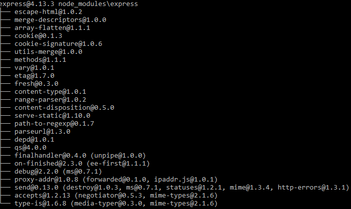
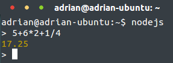
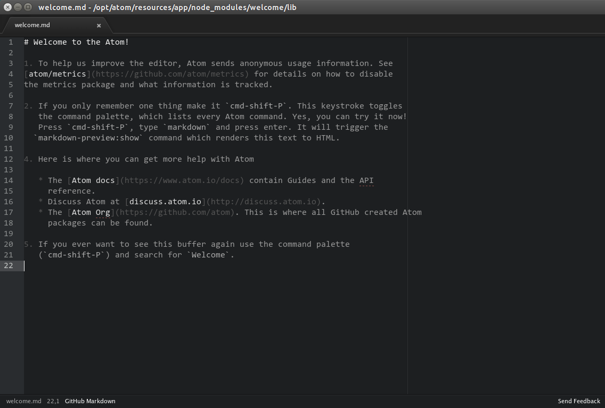
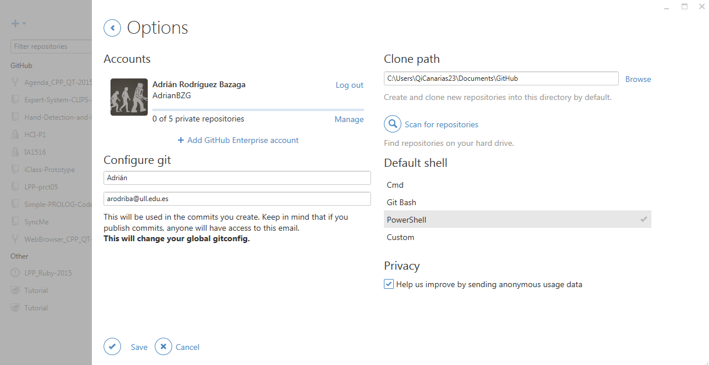
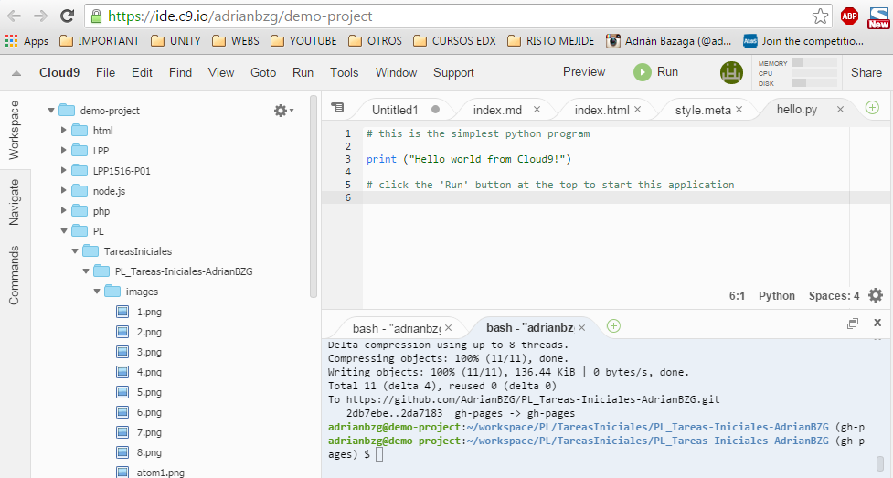
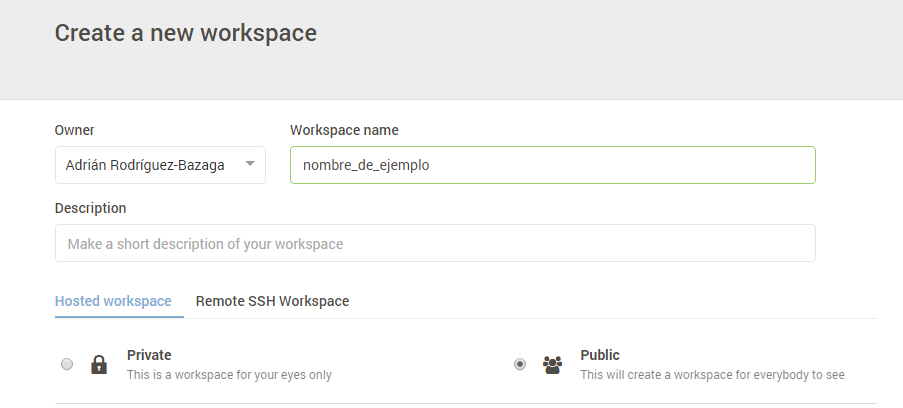
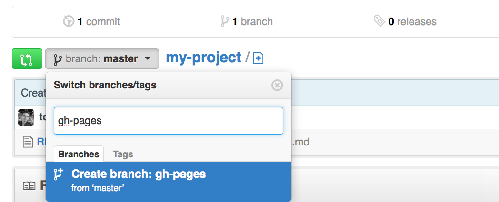
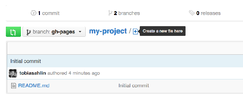
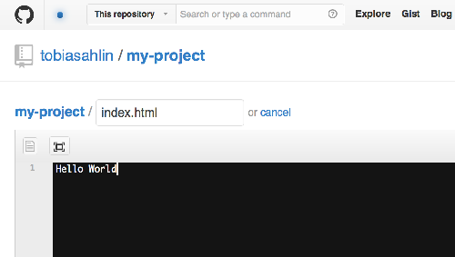
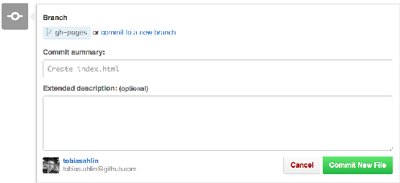

### Procesadores de Lenguajes - Práctica: Tareas Iniciales
#### Alumno: Adrián Rodríguez Bazaga (alu0100826456)
##### Grado en Ingeniería Informática - Itinerario: Computación - Grupo: L1

___

[!] Tutorial de instalación/uso de NodeJS, Express, Atom, GitHub, Cloud9, Markdown, Pandoc y gh-pages: [!]
--------------------------------------------------------------------------------

Índice:
----------

> 1. Introducción
> 2. Instalación de NodeJS y Express
> 3. Instalación del editor de texto Atom
> 4. Instalación de GitHub Desktop (Para Windows)
> 5. Utilización de Cloud9
> 6. Utilización de Markdown
> 7. Utilización de Pandoc
> 8. Utilización de gh-pages (GitHub Pages)
> 9. Enlaces de interés

___

## [1] Introducción:

El siguiente tutorial está pensado para la plataforma **Linux**, especificamente utilizaré el sistema operativo **Linux Ubuntu 14.04**, excepto para **GitHub Desktop** ya que esta aplicación sólo está disponible para la plataforma **Windows**.

___

## [2] Instalación de NodeJS y Express en Linux:

**¿Qué es NodeJS?:** Es un intérprete **Javascript** del lado del servidor que cambia la noción de cómo debería trabajar un servidor. Su meta es permitir a un programador construir aplicaciones altamente escalables y escribir código que maneje decenas de miles de conexiones simultáneas en una sólo una máquina física.

Para empezar a utilizarlo debemos instalarlo, para ello seguiremos los siguientes pasos:

> 1) Abrimos una Terminal de Linux
> 2) Utilizamos el comando "curl -sL https://deb.nodesource.com/setup_5.x | sudo -E bash -" para obtener el instalador de NodeJS versión 5 (la última)
> 3) Lo instalamos con "sudo apt-get install -y nodejs" (Requiere la contraseña del superusuario)
> 4) Opcionalmente podemos instalar las herramientas de desarrollo: "sudo apt-get install -y build-essential"

Ya tenemos NodeJS instalado en nuestra máquina, ahora instalaremos el gestor de paquetes de NodeJS (**npm**):

> 1) Abrimos una Terminal de Linux
> 2) Usamos el comando "sudo apt-get install npm"

Ahora instalaremos **Express**.
**¿Qué es Express?:** Es una infraestructura web rápida, minimalista y flexible para NodeJS

> 1) Abrimos una Terminal de Linux
> 2) Utilizamos npm install express --save
> 3) Alternativamente podemos utilizar la flag 'g' para que se instale de forma global en la máquina y esté disponible en todos los proyectos, esto sería: "npm install express -g --save"

**¿Cómo ejecutar NodeJS?:** Esto es muy sencillo, sólo debemos escribir "nodejs" en la Terminal de Linux, también podemos pasarle como parámetro un fichero JS que será ejecutado como servidor, es decir: "nodejs fichero.js"

___

## [3] Instalación del editor de texto Atom

Usaremos **Atom** como editor de texto para el desarrollo de nuestros proyectos, para ello utilizaremos el **PPA** de **webupd8team**:

> 1) Abrimos una Terminal de Linux
> 2) Utilizamos el comando "sudo add-apt-repository ppa:webupd8team/atom"
> 3) Utilizamos "sudo apt-get update"
> 4) Utilizamos "sudo apt-get install atom"

**¿Cómo ejecutar Atom?:** Simplemente escribimos "atom" en la Terminal y se abrirá el editor.

**NOTA:** Dado que vamos a utilizar el formato **Markdown** es bueno saber que en **Atom** podremos obtener una preview del contenido de nuestro fichero Markdown ya que incorpora el formato **GitHub Markdown** con el comando:

> * Markdown preview `ctrl+shift+m`
> * Markdown export to HTML `Save As HTML`

___

## [4] Instalación de GitHub Desktop

GitHub es una plataforma para alojar proyectos utilizando el sistema de control de versiones **Git**. Para instalarlo accedemos a la página oficial de **GitHub** y descargamos el instalador que ejecutaremos posteriormente para iniciar el asistente de instalación.

Una vez instalado configuramos nuestra cuenta de **GitHub** en la aplicación para poder sincronizar nuestro repositorio tanto local como remoto, en caso de no tener cuenta crearemos una en la página de **GitHub**.

___

## [5] Cloud 9

Es un IDE de desarrollo online, para su uso será necesario crear una cuenta en la página oficial o acceder con las credenciales de GitHub si ya se dispone de una cuenta. Una vez registrados podremos crear proyectos de varias tecnologías como puede ser NodeJS, HTML5, C++, Ruby On Rails, etc.

Si disponemos de algún proyecto en un repositorio de GitHub podremos asociarlo a **Cloud9** para trabajar en él tan solo creando un “`nuevo workspace`” y añadiendo la url *git* del correspondiente repositorio.

Además **Cloud9** permite el trabajo en equipo en el IDE añadiendo miembros a tu workspace.

___

## [6] Markdown

Markdown es un lenguaje de marcado ligero, lo vamos a utilizar en el editor de texto **Atom** ya que incorpora por defecto este formato y podremos obtener un live preview mientras vamos desarrollando además de poder exportarlo a HTML sin la necesidad de usar un conversor adicional.

**¿Cuál es la sintáxis de Markdown?:** Recomiendo acceder a [este Cheatsheet de Markdown](http://assemble.io/docs/Cheatsheet-Markdown.html) donde encontrarás toda la información relativa a Markdown (sintáxis...etc.) con ejemplos y bien clarito.

___

## [7] Pandoc

**¿Qué es Pandoc?:** Pandoc es un traductor (o conversor) de Markdown a HTML, que nos será útil en caso de no utilizar Atom (ya que Atom nos hace esta tarea sin necesidad de instalar paquetes adicionales).Qu

**¿Cómo se instala?:** Sólo debes seguir los siguientes pasos:

> 1. Abrimos una Terminal de Linux
> 2. Utilizamos el comando "sudo apt-get install pandoc"
> 3. Listo

**¿Algún Tip para utilizarlo si quiero pasar de Markdown a HTML?:** Antes de nada te recomienda que visites [esta página](http://pandoc.org/README.html) donde encontrarás todo lo relativo a Pandoc (parámetros...etc.). Por ejemplo, para pasar de Markdown a HTML puedes utilizar el comando "pandoc index.md -f markdown -t html -s -o index.html"

**Explicación de los parámetros que he utilizado para Pandoc en el comando anterior:**

> -f: Formato de entrada
> -t: Formato de salida
> -s: Le pido que me añada la estructura básica del formato de salida (en este caso HTML: sería el body...etc.)
> -o: Nombre del fichero de salida

___

## [8] GitHub Pages

**¿Qué es gh-pages?:** Son páginas para ti y para tus proyectos, alojadas directamente en tu repositorio de GitHub: sólo tienes que editar, pushear y los cambios ya estarán disponibles.

**¿Cómo se utiliza?:** Sólo debes seguir los siguientes pasos en el repositorio de GitHub al que quieras añadir una página:

**> 1. Creamos una rama con el nombre 'gh-pages':**

**> 2. Crea un nuevo fichero:**

**> 3. Llama al fichero index.html y escribe Hello World de contenido:**

**> 4. Haz un commit para el nuevo fichero:**

**> 5. Listo, ahora puedes acceder con la URL: 'http://tu-usuario.github.io/nombre-del-repositorio'**

___

## [9] Enlaces de interés

* 1. [NodeJS](https://nodejs.org)
* 2. [Express](http://expressjs.com)
* 3. [Atom IDE](https://atom.io)
* 4. [GitHub Desktop](https://desktop.github.com)
* 5. [GitHub Pages](https://pages.github.com/)
* 6. [Cloud 9 IDE](https://c9.io)
* 7. [Markdown](http://daringfireball.net/projects/markdown/)
* 8. [Pandoc](http://pandoc.org/README.html)
* 9. [GH-Pages](https://pages.github.com/)
